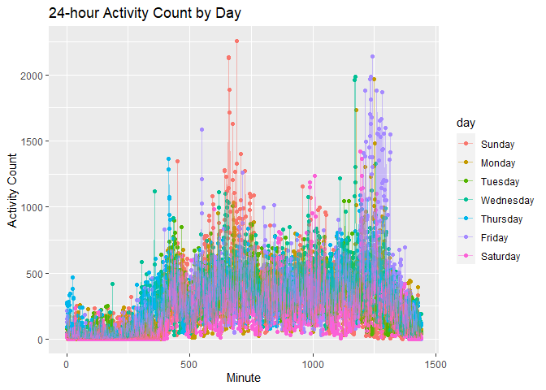

p8105_hw3_qz2266
================
Qing Zhou
2022-10-15

``` r
library(tidyverse)
library(lubridate)
library(p8105.datasets)
library(readxl)
knitr::opts_chunk$set(echo = TRUE)
```

# Problem 2

## Load, tidy, and wrangle the data.

``` r
accel = 
  read_csv("data/accel_data.csv") %>%
  janitor::clean_names() %>%
  pivot_longer(
    activity_1:activity_1440,
    names_to = "act_minute",
    values_to = "act_count") %>%
 
  mutate(
    day_type = case_when(
      day == "Monday" ~ "weekday",
      day == "Tuesday" ~ "weekday",
      day == "Wednesday" ~ "weekday",
      day == "Thursday" ~ "weekday",
      day == "Friday" ~ "weekday",
      day == "Saturday" ~ "weekend",
      day == "Sunday" ~ "weekend" ,
      TRUE     ~ ""
  )) %>%
  
  mutate(
    week = as.integer(week),
    day_id = as.integer(day_id),
    day = factor(day, levels = c("Sunday", "Monday", "Tuesday", "Wednesday", "Thursday", "Friday", "Saturday")),
    day_type = factor(day_type, levels = c("weekday", "weekend"))) %>% 
  relocate(week,day_id, day, day_type)
```

    ## Rows: 35 Columns: 1443
    ## ── Column specification ────────────────────────────────────────────────────────
    ## Delimiter: ","
    ## chr    (1): day
    ## dbl (1442): week, day_id, activity.1, activity.2, activity.3, activity.4, ac...
    ## 
    ## ℹ Use `spec()` to retrieve the full column specification for this data.
    ## ℹ Specify the column types or set `show_col_types = FALSE` to quiet this message.

The data set has 50400 observations, and contains 6 variables, including
week, day_id, day, day_type, act_minute, act_count. Data was collected
across 35 days of 5 weeks.

There are four date variables :

-   day_id is a integer variable that indicates the day when data was
    collected;
-   day is a factor variable that indicates which day it is when data
    was collected;
-   week is a integer variable that indicates the week when data was
    collected.
-   day_type is a factor variable that indicates the information was
    collected on weekend or weekday.

There are two activity variables :

-   act_minute is a character variable that indicates the minute when
    the activity count was collected, corresponding to each minute of a
    24-hour day starting at midnight.
-   On each day, there are 1440 activity counts for each minute of a
    24-hour day starting at midnight, and the corresponding value is
    stored in act_count, which is a numeric variable.

## The total activity over the day

``` r
library(dplyr, warn.conflicts = FALSE)

options(dplyr.summarise.inform = FALSE)

total_act =
  accel %>%
  group_by(week, day) %>%
  dplyr::summarise(total_activity = sum(act_count)) %>% 
  pivot_wider(
    names_from = "day", 
    values_from = "total_activity")
```

We couldn’t see a clear tendency over days. However, we could roughly
find that the total activity across 5 weeks is high on Wednesday,
Thursday and Friday, and low in Saturday. The total activity seemed to
peak on Friday but quickly drop to the bottom on Saturday.

More specifically, the total activity sum of Sunday is 1.919213^{6}, of
Saturday is 1.369237^{6}, of Monday is 1.8586991^{6}, of Tuesday is
1.7992382^{6}, of Wednesday is 2.129772^{6}, of Thursday is
2.0911506^{6}, and of Friday is 2.2917106^{6}.

The user is relatively more active at the beginning of the study than
later on. On Saturdays of week 4 and 5, the data were much lower than
the rest. There might be some problem with the measurement, such as
incorrect use of the device.

## Make a single-panel plot to show the 24-hour activity time courses for each day.

### If use time points as the x-axis:

``` r
accel_mean_plot = 
  accel %>%
  separate(act_minute, into = c("activity", "act_min")) %>%
  select(-activity) %>%
  mutate(
    act_min = as.numeric(act_min)) %>%
  group_by(day, act_min) %>% 
  dplyr::summarise(avg_count = mean(act_count))

accel_mean_plot %>%
  ggplot(aes(x = act_min, y = avg_count, color = day)) + 
  geom_point() +
  geom_line(alpha = 0.5) +
  labs(
    title = "24-hour Activity Count by Day",
    x = "Time Course",
    y = "Activity Count"
  ) + 
  scale_x_continuous(
    breaks = c(0, 360, 720, 1080, 1440), 
    labels = c("12AM", "6AM", "12PM", "6PM", "11:59PM"),
    limits = c(0, 1440)
    )
```

<!-- -->

### If use Minute as the x-axis:

``` r
accel_mean_plot2 = 
  accel %>%
  separate(act_minute, into = c("activity", "act_min")) %>%
  select(-activity) %>%
  mutate(
    act_min = as.numeric(act_min)) %>%
  group_by(day, act_min) %>% 
  dplyr::summarise(avg_count = mean(act_count))

accel_mean_plot2 %>%
  ggplot(aes(x = act_min, y = avg_count, color = day)) + 
  geom_point() +
  geom_line(alpha = 0.5) +
  labs(
    title = "24-hour Activity Count by Day",
    x = "Minute",
    y = "Activity Count"
    )
```

<!-- -->
