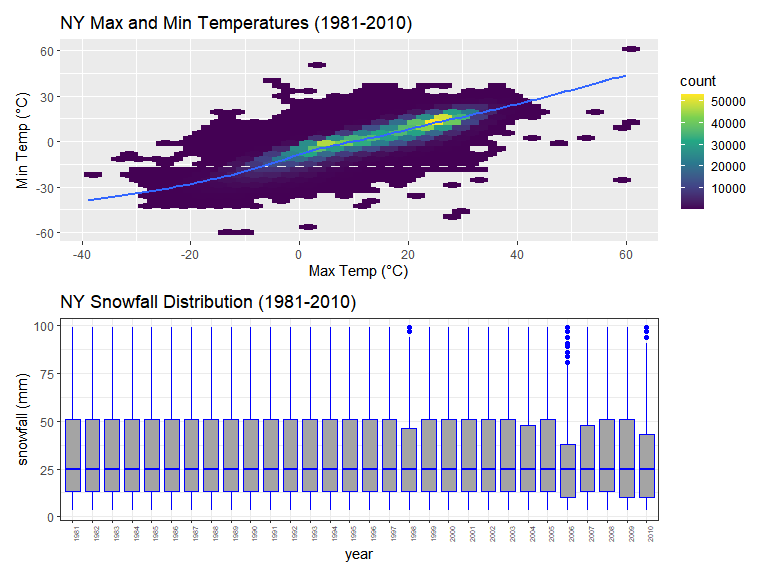

p8105_hw3_qz2266
================
Qing Zhou
2022-10-15

``` r
library(tidyverse)
library(lubridate)
library(readxl)

knitr::opts_chunk$set(
    echo = TRUE,
    warning = FALSE,
    fig.width = 8, 
  fig.height = 6,
  out.width = "90%"
)
```

### Problem 2

#### Load, tidy, and otherwise wrangle the data. Your final dataset should include all originally observed variables and values; have useful variable names; include a weekday vs weekend variable; and encode data with reasonable variable classes. Describe the resulting dataset.

``` r
accel = 
  read_csv("data/accel_data.csv") %>%
  janitor::clean_names() %>%
  pivot_longer(
    activity_1:activity_1440,
    names_to = "act_minute",
    values_to = "act_count") %>%
 
  mutate(
    day_type = case_when(
      day == "Monday" ~ "weekday",
      day == "Tuesday" ~ "weekday",
      day == "Wednesday" ~ "weekday",
      day == "Thursday" ~ "weekday",
      day == "Friday" ~ "weekday",
      day == "Saturday" ~ "weekend",
      day == "Sunday" ~ "weekend" ,
      TRUE     ~ ""
  )) %>%
  
  mutate(
    week = as.integer(week),
    day_id = as.integer(day_id),
    day = factor(day, levels = c("Sunday", "Monday", "Tuesday", "Wednesday", "Thursday", "Friday", "Saturday")),
    day_type = factor(day_type, levels = c("weekday", "weekend"))) %>% 
  relocate(week,day_id, day, day_type)
```

    ## Rows: 35 Columns: 1443
    ## ── Column specification ────────────────────────────────────────────────────────
    ## Delimiter: ","
    ## chr    (1): day
    ## dbl (1442): week, day_id, activity.1, activity.2, activity.3, activity.4, ac...
    ## 
    ## ℹ Use `spec()` to retrieve the full column specification for this data.
    ## ℹ Specify the column types or set `show_col_types = FALSE` to quiet this message.

The data set has 50400 observations, and contains 6 variables, including
week, day_id, day, day_type, act_minute, act_count. Data was collected
across 35 days of 5 weeks.

There are four date variables :

-   day_id is a integer variable that indicates the day when data was
    collected;
-   day is a factor variable that indicates which day it is when data
    was collected;
-   week is a integer variable that indicates the week when data was
    collected.
-   day_type is a factor variable that indicates the information was
    collected on weekend or weekday.

There are two activity variables :

-   act_minute is a character variable that indicates the minute when
    the activity count was collected, corresponding to each minute of a
    24-hour day starting at midnight.
-   On each day, there are 1440 activity counts for each minute of a
    24-hour day starting at midnight, and the corresponding value is
    stored in act_count, which is a numeric variable.

#### Using your tidied dataset, aggregate across minutes to create a total activity variable for each day, and create a table showing these totals.

``` r
library(dplyr, warn.conflicts = FALSE)

options(dplyr.summarise.inform = FALSE)

total_act =
  accel %>%
  group_by(week, day) %>%
  dplyr::summarise(total_activity = sum(act_count)) %>% 
  pivot_wider(
    names_from = "day", 
    values_from = "total_activity")
```

We couldn’t see any apparent trends over days. However, we could roughly
find that the total activity across 5 weeks is high on Wednesday,
Thursday and Friday, and low in Saturday. The total activity seemed to
peak on Friday but quickly drop to the bottom on Saturday.

More specifically, the total activity sum of Sunday is 1.919213^{6}, of
Saturday is 1.369237^{6}, of Monday is 1.8586991^{6}, of Tuesday is
1.7992382^{6}, of Wednesday is 2.129772^{6}, of Thursday is
2.0911506^{6}, and of Friday is 2.2917106^{6}.

The user is relatively more active at the beginning of the study than
later on. On Saturdays of week 4 and 5, the data were much lower than
the rest. There might be some problem with the measurement, such as
incorrect use of the device.

#### Make a single-panel plot to show the 24-hour activity time courses for each day.

``` r
accel_plot = 
  accel %>%
  separate(act_minute, into = c("activity", "act_min")) %>%
  select(-activity) %>%
  mutate(
    act_min = as.numeric(act_min))

accel_plot %>%
  group_by(day_id) %>%
  ggplot(aes(x = act_min, y = act_count, color = day)) +
  geom_point() +
  geom_line() +
  
  labs(
    title = "24-hour Activity Count by Day",
    x = "Minute",
    y = "Activity Count"
  )
```


#### To make it easier to intepret the data, we use the average activity at each minute of the same day of 5 weeks as the y-axis and time points in a 24-hour pattern as the x-axis:

``` r
accel_mean_plot = 
  accel %>%
  separate(act_minute, into = c("activity", "act_min")) %>%
  select(-activity) %>%
  mutate(
    act_min = as.numeric(act_min)) %>%
  group_by(day, act_min) %>% 
  dplyr::summarise(avg_count = mean(act_count))

accel_mean_plot %>%
  ggplot(aes(x = act_min, y = avg_count, color = day)) + 
  geom_point() +
  geom_line(alpha = 0.5) +
  labs(
    title = "24-hour Average Activity Count by Day",
    x = "Time Course",
    y = "Average Activity Count"
  ) + 
  scale_x_continuous(
    breaks = c(0, 360, 720, 1080, 1440), 
    labels = c("12AM", "6AM", "12PM", "6PM", "11:59PM"),
    limits = c(0, 1440)
    )
```


From the plot we could see the average activity count at most time
points are below 2500.There are three peaks located around 7-8AM, 12PM
and 8-9pm. Especially on Friday, there is an obvious peak around 8-9pm.
Moreover, at nights from 12AM to 5AM, the activity counts are pretty
low. It might be because this time slot is the sleeping hour.

### Problem 3

#### Write a description of the dataset, noting the size and structure of the data, describing some key variables, and indicating the extent to which missing data is an issue.

``` r
library(p8105.datasets)
data("ny_noaa")
```

``` r
ny_noaa %>%
  group_by(id) %>%
  summarize(n_obs = n()) 
```

    ## # A tibble: 747 × 2
    ##    id          n_obs
    ##    <chr>       <int>
    ##  1 US1NYAB0001  1157
    ##  2 US1NYAB0006   852
    ##  3 US1NYAB0010   822
    ##  4 US1NYAB0016   214
    ##  5 US1NYAB0017   459
    ##  6 US1NYAB0021   365
    ##  7 US1NYAB0022   273
    ##  8 US1NYAB0023   365
    ##  9 US1NYAB0025   215
    ## 10 US1NYAL0002   549
    ## # … with 737 more rows

``` r
ny_noaa %>%
  summary() 
```

    ##       id                 date                 prcp               snow       
    ##  Length:2595176     Min.   :1981-01-01   Min.   :    0.00   Min.   :  -13   
    ##  Class :character   1st Qu.:1988-11-29   1st Qu.:    0.00   1st Qu.:    0   
    ##  Mode  :character   Median :1997-01-21   Median :    0.00   Median :    0   
    ##                     Mean   :1997-01-01   Mean   :   29.82   Mean   :    5   
    ##                     3rd Qu.:2005-09-01   3rd Qu.:   23.00   3rd Qu.:    0   
    ##                     Max.   :2010-12-31   Max.   :22860.00   Max.   :10160   
    ##                                          NA's   :145838     NA's   :381221  
    ##       snwd            tmax               tmin          
    ##  Min.   :   0.0   Length:2595176     Length:2595176    
    ##  1st Qu.:   0.0   Class :character   Class :character  
    ##  Median :   0.0   Mode  :character   Mode  :character  
    ##  Mean   :  37.3                                        
    ##  3rd Qu.:   0.0                                        
    ##  Max.   :9195.0                                        
    ##  NA's   :591786

``` r
# number of rows with missing data
ny_noaa %>% drop_na() %>% nrow()

# number of columns with missing data
sum(is.na(ny_noaa$id))
sum(is.na(ny_noaa$date))
sum(is.na(ny_noaa$prcp))
sum(is.na(ny_noaa$snow))
sum(is.na(ny_noaa$snwd))
sum(is.na(ny_noaa$tmax))
sum(is.na(ny_noaa$tmin))
```

The ny_noaa data set has 2595176 observations, and 7 variables,
including id, date, prcp, snow, snwd, tmax, tmin:

id: Weather station ID date: Date of observation prcp: Precipitation
(tenths of mm) snow: Snowfall (mm) snwd: Snow depth (mm) tmax: Maximum
temperature (tenths of degrees C) tmin: Minimum temperature (tenths of
degrees C)

Data was collected from 747 weather stations, ranging from 1981-01-01 to
2010-12-31.

There are 1222433 rows with missing data. Among them, 5.6195803 %
missing data for precipitation variable,  
14.689601 % for snowfall, 22.8033089 % for snow depth, 43.7102532 % for
maximum temperature, and 43.7126422 % for minimum temperature.
Therefore, the missing data is an issue, especially for tmax and tmin.

#### Do some data cleaning. Create separate variables for year, month, and day. Ensure observations for temperature, precipitation, and snowfall are given in reasonable units. For snowfall, what are the most commonly observed values?

``` r
ny_noaa =
ny_noaa %>% 
  mutate(
  year = lubridate::year(date),
  month = lubridate::month(date),
  day = lubridate::day(date),
  prcp = prcp/10,
  tmin = as.numeric(tmin)/10,
  tmax = as.numeric(tmax)/10
  ) %>% 
  relocate(id, year, month, day) %>% 
  select(-date)
```

``` r
ncol(ny_noaa)
```

    ## [1] 9

``` r
colnames(ny_noaa)
```

    ## [1] "id"    "year"  "month" "day"   "prcp"  "snow"  "snwd"  "tmax"  "tmin"

``` r
ny_noaa %>%
  count(snow) %>%
  arrange(desc(n)) %>%
  top_n(3) 
```

    ## Selecting by n

    ## # A tibble: 3 × 2
    ##    snow       n
    ##   <int>   <int>
    ## 1     0 2008508
    ## 2    NA  381221
    ## 3    25   31022

The most commonly observed values for snowfall are 0, NA and 25.

#### Make a two-panel plot showing the average max temperature in January and in July in each station across years. Is there any observable / interpretable structure? Any outliers?

``` r
jan_july = 
  ny_noaa %>%
  mutate(
    month = recode_factor(month,
          "01" = "January",
          "02" = "February",
          "03" = "March",
          "04" = "April",
          "05" = "May",
          "06" = "June",
          "07" = "July",
          "08" = "August",
          "09" = "September",
          "10" = "October",
          "11" = "November",
          "12" = "December"),
    year = as.numeric(year)) %>%
  filter(month %in% c("January", "July"))  %>%
  select(id, month, year, tmax) %>%
  group_by(id, year, month) %>% 
  dplyr::summarise(mean_tmax = mean(tmax, na.rm = TRUE))

summary(jan_july)
```

    ##       id                 year           month        mean_tmax      
    ##  Length:14111       Min.   :1981   July    :7108   Min.   :-13.439  
    ##  Class :character   1st Qu.:1988   January :7003   1st Qu.: -0.217  
    ##  Mode  :character   Median :1996   February:   0   Median :  8.635  
    ##                     Mean   :1996   March   :   0   Mean   : 13.312  
    ##                     3rd Qu.:2005   April   :   0   3rd Qu.: 27.003  
    ##                     Max.   :2010   May     :   0   Max.   : 33.600  
    ##                                    (Other) :   0   NA's   :5970

``` r
jan_july %>% ggplot(aes(x = year, y = mean_tmax, color = month)) +
  geom_point(alpha = 0.5) + 
  geom_smooth() + 
  labs(title = "Average Max Temperature in January and July ",
    x = "Year",
    y = "Average Max Temperature (C)" ) +
  facet_grid(~month) 
```

    ## `geom_smooth()` using method = 'gam' and formula 'y ~ s(x, bs = "cs")'


**Comments**: Between 1981 and 2010, the average maximum temperature in
January is lower than the one in July (about 0 vs. 25 degree celsius),
which is consistent with the change of seasons in NY. Moreover,
generally speaking, the average maximum temperature in January of each
year seems vary stronger than the one in July, across all the weather
stations, but their overall trends are quite similar to each other. As
for the outliers, most of them were located in both positive and
negative direction in January, while those in July appeared mostly in
the negative direction.

#### Make a two-panel plot showing (i) tmax vs tmin for the full dataset (note that a scatterplot may not be the best option); and (ii) make a plot showing the distribution of snowfall values greater than 0 and less than 100 separately by year

``` r
tmax_tmin_p = 
  ny_noaa %>% 
  filter(tmax != "NA" & tmin != "NA") %>% 
  ggplot(aes(x = tmax, y = tmin)) + 
  geom_hex(bin = 20) +
  geom_smooth(se = F) +
  scale_fill_viridis_c() +
  labs(
    title = "NY Max and Min Temperatures (1981-2010)",
    x = "Max Temp (°C)",
    y = "Min Temp (°C)"
  )
  theme(legend.position = "right")
```

    ## List of 1
    ##  $ legend.position: chr "right"
    ##  - attr(*, "class")= chr [1:2] "theme" "gg"
    ##  - attr(*, "complete")= logi FALSE
    ##  - attr(*, "validate")= logi TRUE

``` r
tmax_tmin_p
```

    ## `geom_smooth()` using method = 'gam' and formula 'y ~ s(x, bs = "cs")'


``` r
snowfall_p = 
  ny_noaa %>% 
  drop_na(snow) %>%
  filter(snow > 0, snow < 100) %>% 
  mutate(
    year =  as.factor(year)
    ) %>%
  ggplot(aes(x = year, y = snow)) +
  geom_boxplot(fill = '#A4A4A4', color = "blue") +
  
  labs(
      x = "year",
      y = "snowfall (mm)",
      title = "NY Snowfall Distribution (1981-2010)"
    ) + 
  theme_bw() +
  theme(axis.text.x = element_text(angle = 90, size = 5))

snowfall_p
```


``` r
library(patchwork)
tmax_tmin_p / snowfall_p
```

    ## `geom_smooth()` using method = 'gam' and formula 'y ~ s(x, bs = "cs")'



From the above NY Max and Min Temperatures plot we can see from
1981-2010, the temperature differences in NY were not big. Basically,
when the max temperature goes up, the min temperature goes up as well
and verse visa. The line represents the relationship between the max
temperature and the min temperature. It is roughly linear and most days
fluctuates around this line.

There were very few days the temperature went to extreme, since the most
days the max temperatures were below 40 and the min temperatures were
above -30 degree celsius.The most frequently appeared maximum
temperature is \~25°C and the most frequently appeared minimum
temperature is \~15°C.

From the below NY Snowfall Distribution plot we can see the distribution
of snowfall values that are greater than 0 and less than 100 separately
by year, from 1981-2010. The snowfall remains quite even across the
entire period, with a right-skewed distribution or long tail towards
upper snowfall amounts. The median snowfall is around 25 mm and stays
consistent year to year, give or take a few mm. The upper and lower
quartiles are also quite consistent, with the 25th percentile around 15
mm and 75th percentile around 50 mm. There are more outliers showing up
in the year of 1998, 2006 and 2010.

### Problem 1

#### Read in the data

``` r
library(ggridges)

options(
  ggplot2.continuous.colour = "viridis",
  ggplot2.continuous.fill = "viridis"
)

scale_colour_discrete = scale_colour_viridis_d
scale_fill_discrete = scale_fill_viridis_d
```

``` r
data("instacart")

instacart = 
  instacart %>% 
  as_tibble(instacart)
```

#### Answer questions about the data

This dataset contains 1384617 rows and 15 columns, with each row
resprenting a single product from an instacart order. Variables include
identifiers for user, order, and product; the order in which each
product was added to the cart. There are several order-level variables,
describing the day and time of the order, and number of days since prior
order. Then there are several item-specific variables, describing the
product name (e.g. Yogurt, Avocado), department (e.g. dairy and eggs,
produce), and aisle (e.g. yogurt, fresh fruits), and whether the item
has been ordered by this user in the past. In total, there are 39123
products found in 131209 orders from 131209 distinct users.

Below is a table summarizing the number of items ordered from aisle. In
total, there are 134 aisles, with fresh vegetables and fresh fruits
holding the most items ordered by far.

``` r
instacart %>% 
  count(aisle) %>% 
  arrange(desc(n))
```

    ## # A tibble: 134 × 2
    ##    aisle                              n
    ##    <chr>                          <int>
    ##  1 fresh vegetables              150609
    ##  2 fresh fruits                  150473
    ##  3 packaged vegetables fruits     78493
    ##  4 yogurt                         55240
    ##  5 packaged cheese                41699
    ##  6 water seltzer sparkling water  36617
    ##  7 milk                           32644
    ##  8 chips pretzels                 31269
    ##  9 soy lactosefree                26240
    ## 10 bread                          23635
    ## # … with 124 more rows

Next is a plot that shows the number of items ordered in each aisle.
Here, aisles are ordered by ascending number of items.

``` r
instacart %>% 
  count(aisle) %>% 
  filter(n > 10000) %>% 
  mutate(aisle = fct_reorder(aisle, n)) %>% 
  ggplot(aes(x = aisle, y = n)) + 
  geom_point() + 
  labs(title = "Number of items ordered in each aisle") +
  theme(axis.text.x = element_text(angle = 60, hjust = 1))
```


Our next table shows the three most popular items in aisles
`baking ingredients`, `dog food care`, and `packaged vegetables fruits`,
and includes the number of times each item is ordered in your table.

``` r
instacart %>% 
  filter(aisle %in% c("baking ingredients", "dog food care", "packaged vegetables fruits")) %>%
  group_by(aisle) %>% 
  count(product_name) %>% 
  mutate(rank = min_rank(desc(n))) %>% 
  filter(rank < 4) %>% 
  arrange(desc(n)) %>%
  knitr::kable()
```

| aisle                      | product_name                                  |    n | rank |
|:---------------------------|:----------------------------------------------|-----:|-----:|
| packaged vegetables fruits | Organic Baby Spinach                          | 9784 |    1 |
| packaged vegetables fruits | Organic Raspberries                           | 5546 |    2 |
| packaged vegetables fruits | Organic Blueberries                           | 4966 |    3 |
| baking ingredients         | Light Brown Sugar                             |  499 |    1 |
| baking ingredients         | Pure Baking Soda                              |  387 |    2 |
| baking ingredients         | Cane Sugar                                    |  336 |    3 |
| dog food care              | Snack Sticks Chicken & Rice Recipe Dog Treats |   30 |    1 |
| dog food care              | Organix Chicken & Brown Rice Recipe           |   28 |    2 |
| dog food care              | Small Dog Biscuits                            |   26 |    3 |

Finally is a table showing the mean hour of the day at which Pink Lady
Apples and Coffee Ice Cream are ordered on each day of the week. This
table has been formatted in an untidy manner for human readers. Pink
Lady Apples are generally purchased slightly earlier in the day than
Coffee Ice Cream, with the exception of day 5.

``` r
instacart %>%
  filter(product_name %in% c("Pink Lady Apples", "Coffee Ice Cream")) %>%
  group_by(product_name, order_dow) %>%
  summarize(mean_hour = mean(order_hour_of_day)) %>%
  spread(key = order_dow, value = mean_hour) %>%
  knitr::kable(digits = 2)
```

| product_name     |     0 |     1 |     2 |     3 |     4 |     5 |     6 |
|:-----------------|------:|------:|------:|------:|------:|------:|------:|
| Coffee Ice Cream | 13.77 | 14.32 | 15.38 | 15.32 | 15.22 | 12.26 | 13.83 |
| Pink Lady Apples | 13.44 | 11.36 | 11.70 | 14.25 | 11.55 | 12.78 | 11.94 |
